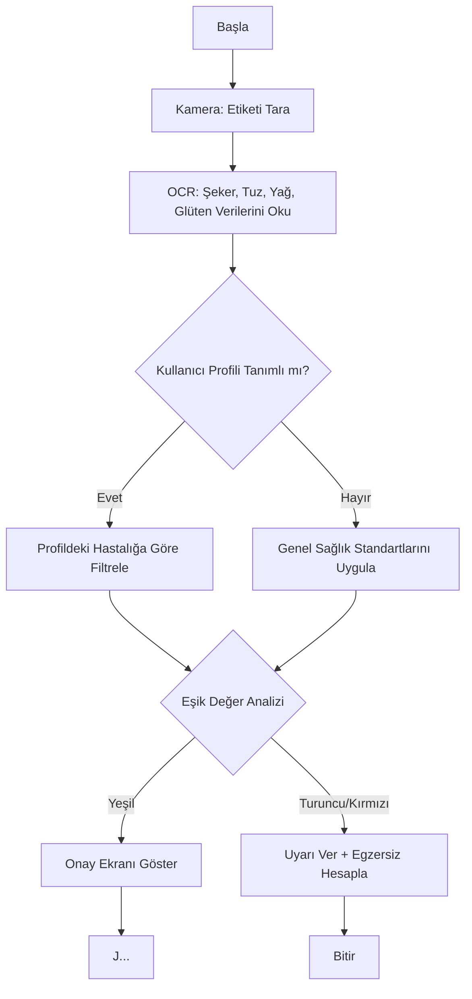

# 🧠 VitaCheck: Karar Destek Mekanizması ve Algoritma Modeli

Bu doküman, kullanıcı hikayelerinde belirtilen sağlık profillerine (Diyabet, Çölyak, Tansiyon) göre sistemin nasıl karar vereceğini ve hangi bilimsel eşik değerlerini baz alacağını açıklar.

## 🚦 1. Sağlık Profili Eşik Değerleri (Risk Analizi)
Sistem, gıda etiketinden okunan değerleri WHO (Dünya Sağlık Örgütü) ve NHS "Traffic Light" standartlarına göre kategorize eder. Değerler her **100g** ürün için geçerlidir.

| Kullanıcı Hikayesi | Kritik Bileşen | 🟢 Yeşil (Düşük Risk) | 🟠 Turuncu (Orta Risk) | 🔴 Kırmızı (Yüksek Risk) |
| :--- | :--- | :--- | :--- | :--- |
| **Diyabet Yönetimi** | Şeker (Sugar) | < 5.0g | 5.0g - 22.5g | > 22.5g |
| **Tansiyon Takibi** | Tuz (Salt) | < 0.3g | 0.3g - 1.5g | > 1.5g |
| **Ebeveyn Denetimi** | Doymuş Yağ | < 1.5g | 1.5g - 5.0g | > 5.0g |
| **Glüten Kontrolü** | Glüten | Bulunmuyor | - | Mevcut (Tolerans <20ppm) |

## 🏃 2. Egzersiz Önerisi ve MET Formülü
Kullanıcı hikayesindeki "Egzersiz Önerisi" özelliği, alınan fazla enerjiyi telafi etmek için **MET (Metabolic Equivalent of Task)** yöntemini kullanır.

### MET Değerleri Aralığı:
- **Hafif (2.5 MET):** Yavaş yürüyüş.
- **Orta (4.5 MET):** Tempolu yürüyüş / Hafif bisiklet.
- **Şiddetli (7.0+ MET):** Koşu / Yüzme.

### Hesaplama Mantığı:
$$Yakılacak Süre (Dakika) = \left( \frac{\text{Besin Kalorisi}}{\text{MET} \times \text{Kullanıcı Kilosu}} \right) \times 60$$

## 🔄 3. Algoritma Akış Şeması
Uygulamanın karar verme süreci aşağıdaki mantıkla çalışır:

## 📚 Kaynakça ve Referanslar

1. **World Health Organization (WHO) (2015):** *Guideline: Sugars intake for adults and children.*
2. **NHS England (2024):** *Check the label: Food labelling and the traffic light system.*
3. **Ainsworth, B. E., et al. (2011):** *2011 Compendium of Physical Activities: A second update of codes and MET values.*
4. **U.S. Food and Drug Administration (FDA) (2023):** *Gluten-Free Labeling of Foods.*
5. **T.C. Sağlık Bakanlığı (2019):** *Türkiye Beslenme Rehberi (TÜBER).*
